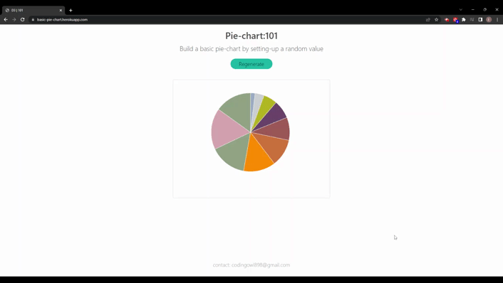

## d3-Pie-chart

The pie chart shows the distribution of a dataset that is randomly generated. The sizes of the slices reflect the data in a form of calculated percentage. 🍕📊
 

## Demo

## Reference

D3

...

 
